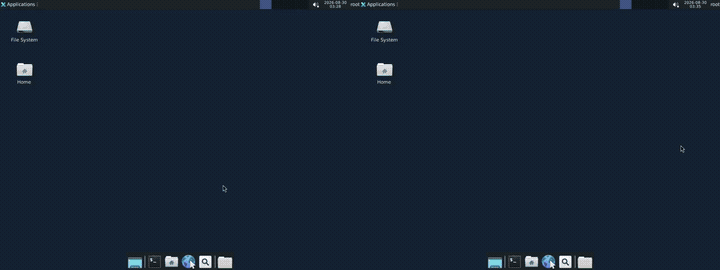

# fps-bench — first-person movement benchmark for cua-driver

A benchmark that measures how reliably cua-driver delivers mouse and keyboard
input to a three.js first-person game (mouse look, WASD, Space) on a Linux
desktop: reach the goal at the far end of an L-shaped platform. A minimal agent
acts only through `cua-driver call …`, and a pi-autoresearch loop patches the
vendored cua-driver source on parallel CUA Fleet sandboxes to raise the score.

Brief: `docs/BRIEF.md`. Design: `docs/plans/2026-08-29-fps-cua-driver-bench-design.md`.
Results: `docs/results/2026-08-29-mouse-look-baseline-vs-exp4.md`.

**Held-key game — left: cua-driver `main` (score 0.0), right: with the kept Exp 4 patch (score 1.0).**
The right side turns at the corner and reaches the goal in ~40 s; the left walks into the corner and never turns.




Full-length, full-quality recordings:
[held-keys-side-by-side.webm](https://github.com/trycua/cua-driver-fps-bench/blob/main/results/videos/held-keys-side-by-side.webm) ·
[mouse-look-side-by-side.webm](https://github.com/trycua/cua-driver-fps-bench/blob/main/results/videos/mouse-look-side-by-side.webm)
(MP4s alongside in `results/videos/`; the GIF above is the full run at 6 fps — the right
side freezes on its final frame once it reaches the goal while the left runs to completion).

## Setup

```bash
uv sync                                   # cua-bench 0.2.11, cua-sandbox (wheels.cua.ai), anthropic
.venv/bin/python scripts/game_check.py    # headless smoke test of the game (no desktop needed)
```

Fleet credentials come from the macOS Keychain entry `cua-sandbox-fleet-api`
(same one pi-cua uses) or `CUA_CLIENT_ID` / `CUA_CLIENT_SECRET`.

## Task

`tasks/fps_lshape/` — `main.py` + `gui/index.html` (three.js r147 + `PointerLockControls`,
vendored). Controls: mouse look, `W/A/S/D` move only while held (6 u/s; a
press-and-release tap goes nowhere), `Space` jump. `evaluate()` → `[reached, progress]`.

```bash
.venv/bin/cb interact tasks/fps_lshape --oracle --no-wait      # oracle solves it via window.__press
.venv/bin/cb run task tasks/fps_lshape --wait --agent-import-path fps_bench.agent:CuaDriverAgent
```

Local runs use docker image `public.ecr.aws/k5j5w0x5/cua-ubuntu-24.04:docker-latest`
(the cua-sandbox local-docker default on trycua/cua main) — but that image lacks
`bench_ui`, which `launch_window()` needs, so for local runs build the arm64 variant
of our image and point at it:

```bash
PLATFORM=linux/arm64 PUSH=0 image/build.sh          # -> fps-bench-cua-driver:local
FPS_BENCH_IMAGE=fps-bench-cua-driver:local .venv/bin/python -m fps_bench.runner --local --episodes 3
```

## Agent

`fps_bench/agent.py` — `CuaDriverAgent`. Reads `window.__state` (privileged
perception); acts only through cua-driver inside the environment: `move_cursor` to
turn (relative mouse motion drives PointerLockControls), `press_key w` to walk, a
`click` first to focus/lock. Re-plans after every action. Per-episode record includes
presses vs keydowns seen (`delivery_ratio`) and mouse pixels sent vs seen (`mouse_ratio`).

## Fleet image

`image/Dockerfile`: `FROM …cua-ubuntu-24.04:docker-latest` + bench_ui/pywebview +
Rust 1.97.1 + sparse clone of `trycua/cua` (`libs/cua-driver`) at `CUA_REF`, crates
pre-fetched. `cua-driver` is compiled natively at container boot by supervisord
(`image/prebuild.sh`) and installed to `/usr/local/bin/cua-driver`.

```bash
image/build.sh        # buildx linux/amd64 → 296062593712.dkr.ecr.us-west-2.amazonaws.com/cua-gymdriver-dev:cua-driver-bench-<date>-<ref>
```

Fleet's pool admission only allows a fixed set of image repositories, which is why
the tag lands in `cua-gymdriver-dev`. Pools use `runtime = gvisor` (plain container).
Current tag: `cua-driver-bench-20260830-hold` (vendored driver: press_key hold_ms + Exp 4 click patch) (also runs a `cua-driver serve` daemon, which `cua-driver call` needs on this build) — the base image's `supervisord.conf` has no
`[include]`, so earlier tags never ran the boot-time build; this one registers it directly
(build + install ≈ 60 s on a gVisor sandbox).

## Autoresearch with pi-cua + pi-autoresearch (primary loop)

The loop is driven by [pi](https://github.com/earendil-works/pi) with two extensions:
[pi-cua](https://github.com/injaneity/pi-cua) executes pi's tools on a CUA Fleet Linux
sandbox whose workspace is synced from this repo's origin, and
[pi-autoresearch](https://github.com/davebcn87/pi-autoresearch) runs the
try → measure → keep/revert loop (`init_experiment` / `run_experiment` / `log_experiment`).

* `cua-driver/` — vendored cua-driver source (trycua/cua `libs/cua-driver`, ref in `cua-driver/UPSTREAM_REF`); the files pi edits.
* `.auto/prompt.md`, `.auto/measure.sh`, `.auto/config.json` — the pi-autoresearch session.
  `measure.sh` bootstraps guest deps (`bench/bootstrap_guest.sh`), rebuilds cua-driver,
  runs `bench/run_in_sandbox.py` on the sandbox's X display and prints `METRIC score=…`.
* `scripts/pi_sandbox.py` — headless wrapper over the pi-cua backend (`create/list/delete/bind`).
* `scripts/pi_autoresearch.sh <sandbox> [iterations]` — pins a fresh pi session to a sandbox
  and runs the loop non-interactively; run one per sandbox for parallel hill-climbs.

The origin is private, and pi-cua clones the workspace on the sandbox, so
`scripts/guest_bootstrap.py` (run automatically by the launcher) injects a GitHub
token at runtime as a `git` credential-store entry for user `cua` — per
[sandbox secrets](https://cua.ai/docs/how-to-guides/sandbox/secrets), never into the
image. It uses `GH_SANDBOX_TOKEN` (prefer a fine-grained read-only PAT) or falls back
to `gh auth token`.

```bash
pi install npm:pi-autoresearch                       # once (pi-cua already installed)
.venv/bin/python scripts/pi_sandbox.py create fps-a --wait
.venv/bin/python scripts/pi_sandbox.py create fps-b --wait
scripts/pi_autoresearch.sh fps-a 20 & scripts/pi_autoresearch.sh fps-b 20 & wait
```

Interactive alternative: `pi` → `/sandbox fps-a` → `/autoresearch raise cua-driver key delivery score`.

## Autoresearch with the standalone Fleet loop (alternative)

```bash
.venv/bin/python scripts/fleet_smoke.py --image <image> --pool fps-bench-smoke --bench   # 1 sandbox, 1 episode
FPS_BENCH_FLEET_IMAGE=<image> .venv/bin/python -m fps_bench.autoresearch --workers 3 --iterations 5 --episodes 3
```

Each worker: Claude (`claude-opus-5`) proposes a diff → claim sandbox → `git apply` +
`cargo build --release -p cua-driver` → benchmark → append to
`results/experiments.jsonl` → release claim. Best patch is kept in `results/best.diff`.
